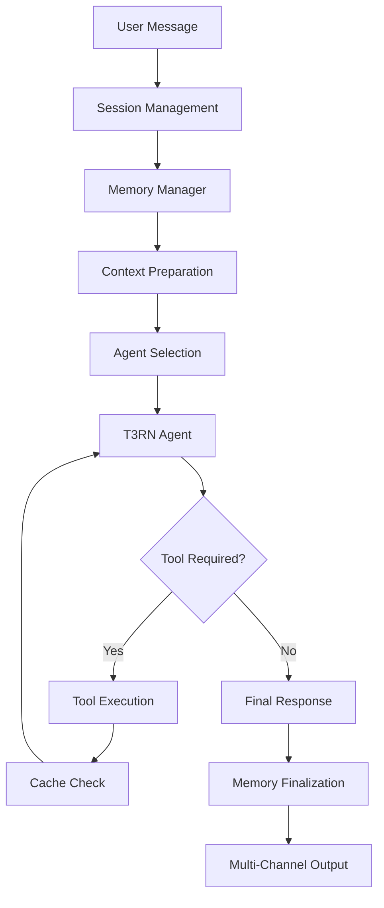

# System Architecture Documentation

## Overview

This document describes the advanced architecture of the Workload ChatGPT system, focusing on innovative features and architectural decisions that make this LLM-based game assistant unique and efficient.

## Table of Contents

1. [LLM Flow Architecture](#llm-flow-architecture)
2. [Agent Workflow System](#agent-workflow-system)
3. [Intelligent Fallback Mechanism](#intelligent-fallback-mechanism)
4. [Context Injection System](#context-injection-system)
5. [Memory Summarization](#memory-summarization)
6. [Tool Result Caching](#tool-result-caching)

---

## LLM Flow Architecture

### Multi-Channel Communication System

The system implements a sophisticated 9-channel output system that organizes information by type:

```
Channel 0: Main (Primary responses)
Channel 1: Logs (System logs and debugging)
Channel 2: Extended Think (Agent reasoning process)
Channel 3: Tool Calls (Function execution details)
Channel 4: Tokens (Token usage statistics)
Channel 5: Memory (Memory management logs)
Channel 6: Agent Stack (Agent execution flow)
Channel 7: Performance (Timing and performance metrics)
Channel 8: Tool Errors (Error handling for tools)
```

### Request Processing Flow



---

## Agent Workflow System

### Agent Stack Architecture

The system uses a sophisticated agent stack that allows for nested agent execution:

1. **T3RN Agent** - Primary game assistant with Star Wars personality
2. **Fallback Agent** - Handles errors and edge cases
3. **Tool Agents** - Specialized agents for specific tool categories

### Agent Execution Flow

```python
# Pseudo-code representation
agent_stack = []
agent_stack.append(T3RNAgent)

while agent_stack:
    current_agent = agent_stack.pop()
    result = current_agent.execute(context)
    
    if result.needs_clarification:
        agent_stack.append(ClarificationAgent)
    elif result.error:
        agent_stack.append(FallbackAgent)
    else:
        return result.final_answer
```

### Key Features:
- **Stateless Agents**: Each agent execution is independent
- **Context Preservation**: Full context passed between agents
- **Tool Loop Management**: Internal tool execution within agents
- **Iteration Limits**: Maximum 10 iterations per agent to prevent infinite loops

---

## Intelligent Fallback Mechanism

### Multi-Level Fallback Strategy

1. **Primary Agent Failure**
   - T3RN Agent attempts with full tool access
   - If fails, context passed to Fallback Agent

2. **Fallback Agent**
   - Uses different LLM model (magistral/hermes)
   - No tool access - pure language response
   - Provides helpful error messages

3. **Emergency Fallback**
   - Hardcoded responses for critical failures
   - Ensures user always receives a response

### Error Categories Handled:
- LLM connection failures
- Tool execution errors
- Context size limitations
- Invalid responses
- Timeout scenarios

---

## Context Injection System

### Screen-Aware Context Injection

The system intelligently injects context based on the current game screen:

```python
# Example injection for Champion Details screen
{
    "screen": "ChampionFeatureModelsPresenter",
    "injection": "You are currently on the Champion Details screen. 
                  The user is viewing champion 'Droideka'.",
    "proactive_tools": [
        "db_get_ux_details",
        "gcs_get_character_details_by_id"
    ]
}
```

### Key Innovations:

1. **Conversation History Injection**
   - Context injected as assistant messages, not system prompts
   - More natural and less intrusive
   - Preserves LLM's response patterns

2. **Proactive Tool Execution**
   - Tools executed automatically based on screen context
   - Results cached before user asks questions
   - Significantly reduces response latency

3. **One-Time Injection**
   - Context injected only at session start
   - Prevents redundant processing
   - Maintains conversation flow

---

## Memory Summarization

### Intelligent Memory Management

The system implements a sophisticated memory management strategy:

```
┌─────────────────────────────────────┐
│         Memory Structure            │
├─────────────────────────────────────┤
│ Summary (Compressed History)        │
│   └── LLM-compressed when > 4KB    │
├─────────────────────────────────────┤
│ Exchanges List (Last 10 Q&As)      │
│   ├── Exchange 1: Q + A            │
│   ├── Exchange 2: Q + A            │
│   └── ...                          │
├─────────────────────────────────────┤
│ Tool Cache (Active Results)         │
│   └── Cached for N exchanges       │
└─────────────────────────────────────┘
```

### Summarization Rules:

1. **Large Answer Compression**
   - Answers > 750 bytes automatically summarized
   - Preserves key information while reducing size

2. **Exchange Limit**
   - Maximum 10 exchanges in active memory
   - Older exchanges moved to summary

3. **Summary Compression**
   - When summary > 4KB, LLM compresses it
   - Target size: 3KB for optimal context usage

4. **LLM-Powered Summarization**
   - Uses GPT-4o-mini for intelligent compression
   - Maintains context relevance
   - Falls back to truncation if LLM fails

---

## Tool Result Caching

### Dynamic Cache Duration System

Each tool can specify how long its results should be cached:

```json
{
    "status": "success",
    "champion_data": "...",
    "llm_cache_duration": 3,  // Cache for 3 exchanges
    "internal_info": {...}
}
```

### Cache Lifecycle:

1. **Cache Addition**
   - Tool results with `llm_cache_duration > 0` are cached
   - Unique hash generated from tool name + parameters

2. **Cache Usage**
   - Before executing tool, check cache
   - If found, return cached result
   - Refresh duration to original value

3. **Cache Expiration**
   - Duration decrements after each exchange
   - Expired entries removed automatically

4. **Cache Benefits**
   - Eliminates redundant API/DB calls
   - Reduces response latency
   - Preserves context across exchanges

### Current Cache Durations:
- `gcs_get_champion_details`: 3 exchanges
- `gcs_get_character_details_by_id`: 3 exchanges
- `db_get_lore_details`: 3 exchanges
- `db_get_ux_details`: 2 exchanges

### Cache State Visibility:

```
=== FUNCTION CACHE STATE ===
Cached functions: 2
  • gcs_get_champion_details({'champion_name': 'droideka'}): 2/3 exchanges remaining
  • db_get_ux_details({'query': 'Champion screen...'}): 1/2 exchanges remaining
```

---

## Technical Innovations Summary

1. **Hybrid Memory Architecture**
   - Combines summarization with intelligent caching
   - Optimizes context window usage

2. **Proactive Intelligence**
   - Anticipates user needs based on context
   - Pre-loads relevant data

3. **Flexible Tool System**
   - Tools control their own cache duration
   - Dynamic parameter-based caching

4. **Graceful Degradation**
   - Multiple fallback levels
   - Always provides user response

5. **Observability**
   - Multi-channel logging system
   - Real-time performance metrics
   - Cache state visibility

This architecture creates a responsive, intelligent, and resilient LLM system that provides excellent user experience while optimizing resource usage.