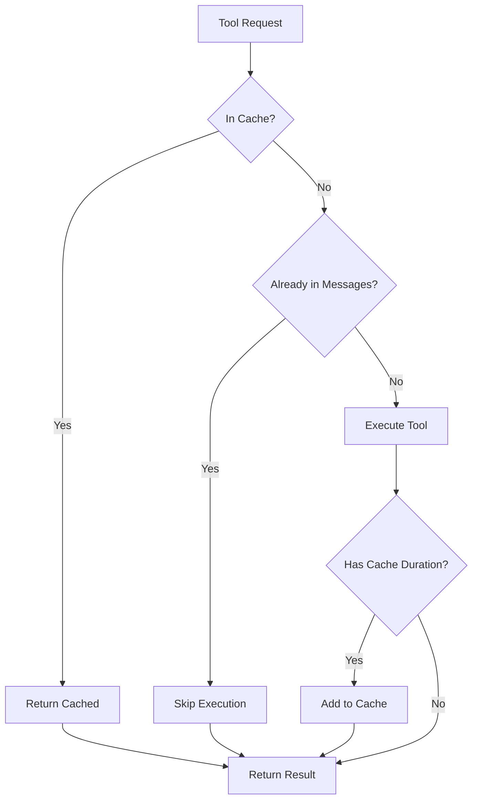

# Agent System Documentation

## Overview

The Agent System implements a sophisticated multi-agent architecture for handling complex LLM interactions with fallback mechanisms and specialized tool handling.

## Agent Architecture

```
BaseAgent (Abstract)
├── T3RNAgent (Primary)
│   ├── Tool Execution Loop
│   ├── Cache Integration
│   └── Response Generation
├── FallbackAgent (Emergency)
│   ├── No Tool Access
│   ├── Different LLM Model
│   └── Error Recovery
└── SpecializedAgents (Future)
    ├── ClarificationAgent
    └── ToolSpecificAgents
```

## T3RN Agent

### Overview
The T3RN (Tactical-3 Reconnaissance Navigator) Agent is the primary agent that embodies a Star Wars droid personality while providing game assistance.

### Key Features

1. **Tool Execution Loop**
   ```python
   max_iterations = 10
   for iteration in range(max_iterations):
       if iteration == max_iterations:
           # Final iteration - no tools, force answer
           response = call_llm(messages, tools=None)
       else:
           # Normal iteration with tools
           response = call_llm(messages, tools=self.tools)
           
       if has_tool_calls:
           execute_tools()
           continue
       else:
           return final_answer
   ```

2. **Cache-Aware Tool Execution**
   ```python
   # Check cache before execution
   cache_entry = memory_manager.lookup_tool_in_cache(session, tool_name, params)
   if cache_entry:
       result = cache_entry['result']
       log("Cache hit")
   else:
       result = execute_tool()
       if llm_cache_duration > 0:
           memory_manager.add_tool_to_cache(session, tool_name, params, result, duration)
   ```

3. **Complementary Tools System**
   - Automatically adds related tools
   - Example: champion search → add details tool
   - Reduces round trips

### System Prompt Structure
```python
system_prompt = f"""
{T3RN_BASE_SYSTEM_PROMPT}
{T3RN_TOOL_INSTRUCTIONS}
{T3RN_RESPONSE_FORMATTING}
{T3RN_PERSONALITY_TRAITS}
{CURRENT_SCREEN_CONTEXT}  # Injected context
"""
```

## Fallback Agent

### Purpose
Provides graceful degradation when primary agent fails.

### Key Differences
1. **No Tool Access** - Pure language model responses
2. **Different Model** - Uses magistral/hermes for diversity
3. **Error Context** - Receives error information from primary

### Activation Triggers
- T3RN Agent exception
- Tool execution failures
- Context size exceeded
- LLM connection errors

### Response Strategy
```python
fallback_prompt = f"""
Previous agent failed with: {error_message}
Provide helpful response without tools.
Context: {user_question}
"""
```

## Agent Context

### AgentContext Structure
```python
@dataclass
class AgentContext:
    session_data: Dict[str, Any]
    original_user_message: str
    conversation_history: List[Message]
    error_context: Optional[str] = None
    metadata: Dict[str, Any] = field(default_factory=dict)
```

### Context Flow
1. User message → AgentContext creation
2. Context enriched with session data
3. Memory Manager adds history
4. Screen injection adds context
5. Agent processes with full context

## Agent Stack System

### Stack Management
```python
agent_stack = []

# Push agents based on need
if needs_clarification:
    agent_stack.append(ClarificationAgent)
elif primary_failed:
    agent_stack.append(FallbackAgent)
else:
    agent_stack.append(T3RNAgent)

# Execute stack
while agent_stack:
    agent = agent_stack.pop()
    result = agent.execute(context)
    process_result(result)
```

### Benefits
- Flexible agent composition
- Clean error handling
- Extensible architecture

## Tool Integration

### Tool Categories
1. **Cache Tools** - Static data lookups
2. **RAG Tools** - Semantic search
3. **GCS Tools** - Database queries

### Tool Execution Flow


## Performance Features

### 1. Iteration Management
- Maximum 10 iterations per agent
- Final iteration forces answer without tools
- Prevents infinite loops

### 2. Tool Deduplication
- Checks if tool+params already in messages
- Prevents redundant executions
- Maintains conversation coherence

### 3. Cache Integration
- Seamless cache checking
- Automatic result caching
- Duration-based lifecycle

## Error Handling

### Multi-Level Strategy
1. **Tool Errors** - Logged, continue with other tools
2. **LLM Errors** - Retry with exponential backoff
3. **Agent Errors** - Fallback to secondary agent
4. **System Errors** - Emergency hardcoded response

### Error Propagation
```python
try:
    result = t3rn_agent.execute(context)
    if not result.final_answer:
        raise AgentError("No answer generated")
except Exception as e:
    context.error_context = str(e)
    result = fallback_agent.execute(context)
```

## Logging and Observability

### Channel Usage
- **Channel 1 (Logs)**: Agent execution flow
- **Channel 2 (Extended Think)**: Agent reasoning
- **Channel 3 (Tool Calls)**: Tool execution details
- **Channel 6 (Agent Stack)**: Stack operations

### Key Metrics
- Iteration count per request
- Tool execution count
- Cache hit rate
- Fallback activation rate

## Best Practices

1. **Agent Design**
   - Keep agents stateless
   - Pass full context
   - Handle errors gracefully

2. **Tool Usage**
   - Check cache first
   - Avoid duplicates
   - Set appropriate cache durations

3. **Error Handling**
   - Always provide fallback
   - Log errors comprehensively
   - Maintain user experience

## Future Enhancements

1. **Specialized Agents**
   - Battle Strategy Agent
   - Team Building Agent
   - Resource Management Agent

2. **Dynamic Agent Selection**
   - Context-based routing
   - Performance-based selection
   - User preference learning

3. **Agent Collaboration**
   - Multi-agent consultation
   - Consensus mechanisms
   - Specialized expertise sharing