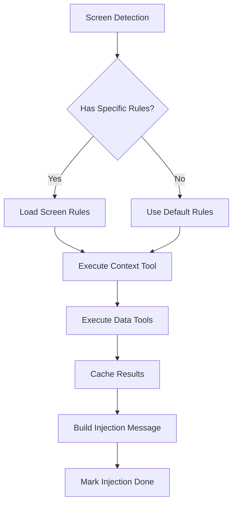

# Context Injection System Documentation

## Overview

The Context Injection System provides intelligent, screen-aware context to the LLM at the start of each session, dramatically improving response relevance and reducing latency through proactive tool execution.

## Architecture

```
Context Injection System
├── Screen Detection
│   └── JSON Data Analysis
├── Rule Configuration
│   ├── Screen-Specific Rules
│   └── Default Fallback Rules
├── Prompt Injection
│   └── Conversation History Method
└── Proactive Tools
    ├── Context Tools
    └── Data Tools
```

## Key Innovation: Conversation History Injection

Instead of modifying the system prompt (which can alter LLM behavior), the system injects context as part of the conversation history:

```python
# Traditional approach (problematic)
system_prompt += "\nCURRENT CONTEXT: You are on Champion Details screen..."

# Our approach (natural)
messages.append({
    "role": "assistant",
    "content": "I can see you're currently on a specific screen. Let me provide context: You are currently on the Champion Details screen viewing champion 'Droideka'."
})
```

### Benefits:
- Preserves LLM's natural response patterns
- Less intrusive than system prompt modification
- Appears as natural conversation flow
- Can be easily extended without affecting core behavior

## Screen Detection

### JSON Data Structure
```json
{
    "screenData": {
        "Screen": "ChampionFeatureModelsPresenter",
        "Popups": [],
        "ScreensData": {
            "ChampionFeatureModelsPresenter": {
                "ChampionConfigId": "champion.sw1.droideka"
            }
        }
    },
    "ChampionConfigId": "champion.sw1.droideka"
}
```

### Detection Logic
```python
def analyze_screen_context(json_data):
    screen_context = {
        "screen_name": json_data["screenData"]["Screen"],
        "popups": json_data["screenData"]["Popups"],
        "data_fields": extract_fields(json_data)
    }
    return screen_context
```

## Rule Configuration System

### Screen-Specific Rules

```python
SCREEN_TOOL_RULES = {
    "ChampionFeatureModelsPresenter": {
        "context_tool": {
            "tool": "db_get_ux_details",
            "parameters": {"query": "ChampionFeatureModelsPresenter"}
        },
        "data_tools": [{
            "tool": "gcs_get_character_details_by_id",
            "json_field": "ChampionConfigId",
            "parameter_name": "character_id"
        }],
        "prompt_injection": {
            "template": "You are currently on the Champion Details screen. The user is viewing champion '{ChampionConfigId_translated}'. Focus your responses on this specific champion.",
            "required_fields": ["ChampionConfigId"],
            "translate_fields": {"ChampionConfigId_translated": "ChampionConfigId"}
        }
    }
}
```

### Rule Components

1. **Context Tool**
   - Provides screen-specific help/documentation
   - Usually RAG-based for flexibility
   - Static parameters

2. **Data Tools**
   - Extract data based on JSON fields
   - Dynamic parameters from screen data
   - Multiple tools supported

3. **Prompt Injection**
   - Template with placeholders
   - Required fields validation
   - Translation support for IDs

### Default Rules

For screens without specific configuration:

```python
DEFAULT_SCREEN_RULES = {
    "context_tool": {
        "tool": "db_get_ux_details",
        "parameters": {"query": "{screen_name}"}
    },
    "data_tools": [],
    "prompt_injection": {
        "template": "You are currently on the '{screen_name}' screen.",
        "required_fields": []
    }
}
```

## Proactive Tool Execution

### Execution Flow



### Tool Selection Logic

```python
def get_applicable_tools(screen_context):
    rules = get_screen_tool_rules(screen_name)
    tools_to_execute = []
    
    # Add context tool
    if "context_tool" in rules:
        tools_to_execute.append(rules["context_tool"])
    
    # Add data tools if fields available
    for data_tool in rules.get("data_tools", []):
        if data_tool["json_field"] in screen_context["data_fields"]:
            tools_to_execute.append(data_tool)
    
    return tools_to_execute
```

### Result Caching

All proactive tool results are automatically cached:

```python
def _cache_proactive_tool_results(session, proactive_messages):
    for tool_msg in proactive_messages:
        result_json = json.loads(tool_msg['content'])
        duration = result_json.get('llm_cache_duration', 0)
        
        if duration > 0:
            add_tool_to_cache(
                session, tool_name, parameters, 
                result, duration
            )
```

## Implementation in Memory Manager

### One-Time Injection

```python
def inject_screen_context(session, json_data, channel_logger):
    # Only inject once per session
    if memory['screen_injection_done']:
        return []
    
    # Get and execute proactive tools
    proactive_messages, prompt_injection = get_proactive_tool_messages(json_data)
    
    # Build injection messages
    injection_messages = []
    
    # Add context message
    if prompt_injection:
        injection_messages.append({
            "role": "assistant",
            "content": f"I can see you're currently on a specific screen. Let me provide context: {prompt_injection}"
        })
    
    # Add tool results
    injection_messages.extend(proactive_messages)
    
    # Cache results and mark as done
    _cache_proactive_tool_results(session, proactive_messages)
    memory['screen_injection_done'] = True
    
    return injection_messages
```

### Integration with Agent

```python
# In T3RNAgent.execute()
messages = []
messages.append({"role": "system", "content": system_prompt})
messages.extend(memory_messages)  # Includes history

# Add screen context injection
if CURRENT_JSON_DATA:
    injection_messages = memory_manager.inject_screen_context(
        session, CURRENT_JSON_DATA, channel_logger
    )
    messages.extend(injection_messages)

messages.append({"role": "user", "content": current_user_message})
```

## Benefits and Impact

### 1. Improved Response Relevance
- LLM knows current context immediately
- Responses tailored to screen state
- Reduced need for clarification

### 2. Performance Optimization
- Tools executed before user asks
- Results cached for reuse
- Significantly reduced latency

### 3. Natural Conversation Flow
- Context appears as conversation
- No system prompt pollution
- Maintains LLM personality

### 4. Extensibility
- Easy to add new screens
- Simple rule configuration
- No code changes needed

## Configuration Examples

### Battle Screen Configuration
```python
"BattleModelsPresenter": {
    "context_tool": {
        "tool": "db_get_ux_details",
        "parameters": {"query": "Battle screen mechanics"}
    },
    "data_tools": [
        {
            "tool": "gcs_get_battle_details",
            "json_field": "BattleId",
            "parameter_name": "battle_id"
        },
        {
            "tool": "gcs_get_enemy_details",
            "json_field": "EnemyIds",
            "parameter_name": "enemy_ids"
        }
    ],
    "prompt_injection": {
        "template": "You are on the Battle screen. Battle: {BattleId}, facing enemies: {EnemyIds}.",
        "required_fields": ["BattleId", "EnemyIds"]
    }
}
```

### Inventory Screen Configuration
```python
"InventoryPresenter": {
    "context_tool": {
        "tool": "db_get_ux_details",
        "parameters": {"query": "Inventory management"}
    },
    "data_tools": [],
    "prompt_injection": {
        "template": "You are on the Inventory screen. The user is managing their items and resources.",
        "required_fields": []
    }
}
```

## Monitoring and Debugging

### Logging
The system provides detailed logging:

```
🚀 Starting proactive tool analysis
✅ Screen context found: ChampionFeatureModelsPresenter
✅ Data fields available: ['ChampionConfigId', 'Level', 'Stars']
✅ Added context tool: db_get_ux_details
✅ Added data tool: gcs_get_character_details_by_id with ChampionConfigId=champion.sw1.droideka
🔧 Executing proactive tool: db_get_ux_details
✅ Tool db_get_ux_details executed successfully
🔧 Executing proactive tool: gcs_get_character_details_by_id
✅ Tool gcs_get_character_details_by_id executed successfully
✅ Built prompt injection for ChampionFeatureModelsPresenter: 156 chars
✅ Proactive analysis completed. Tools: 4 messages, Prompt: 156 chars
```

### Cache Visibility
```
=== FUNCTION CACHE STATE ===
Cached functions: 2
  • gcs_get_character_details_by_id({'character_id': 'champion.sw1.dr...}): 3/3 exchanges remaining
  • db_get_ux_details({'query': 'ChampionFeatureModelsPresenter'}): 2/2 exchanges remaining
```

## Best Practices

1. **Rule Design**
   - Keep templates concise
   - Validate required fields
   - Use meaningful field names

2. **Tool Selection**
   - Only include relevant tools
   - Consider data availability
   - Set appropriate cache durations

3. **Performance**
   - Limit number of proactive tools
   - Use efficient queries
   - Monitor execution time

4. **User Experience**
   - Natural language in templates
   - Focus on user's current task
   - Avoid information overload

## Future Enhancements

1. **Dynamic Rule Learning**
   - Track successful patterns
   - Auto-generate rules
   - A/B testing injection strategies

2. **Multi-Screen Context**
   - Handle popup overlays
   - Track navigation history
   - Predict next screen

3. **Personalization**
   - User preference learning
   - Custom injection templates
   - Adaptive tool selection